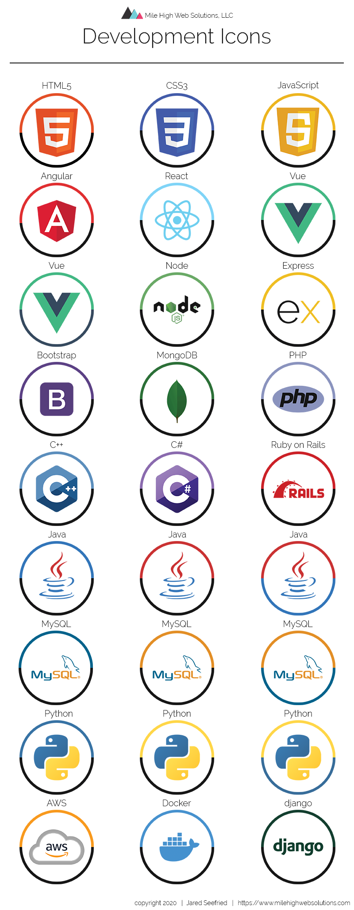

# Development Icons - Mile High Web Solutions, LLC

## Table of Contents

- **[Description](#Description)**
- **[Installation Requirements](#Installation-Requirements)**
- **[License](#License)**
- **[Questions](#Questions)**

# Description

This repository is a collection of icons aimed towards coding and development. Each folder contains Photoshop .PSD, .SVG, .PNG, .JPEG and .PDF file formats to be used as needed. .SVG and .PNG have transparent backgrounds for the use for Web and Marketing materials. The PSD file can be used to change how you would like.

## Development Icons List

---

# Download Repository

git clone - https://github.com/jaredseefried/Development-Icons.git

- Files can be downloaded individually from their respective folder location.

# Author

Jared Seefried - April 2020

# License

MIT - Open for public use.

# Have Questions?

## [Github Profile: github.com/jaredseefried](https://github.com/jaredseefried "Title")

Please email me at jared.seefried@yahoo.com if you have additional questions.
